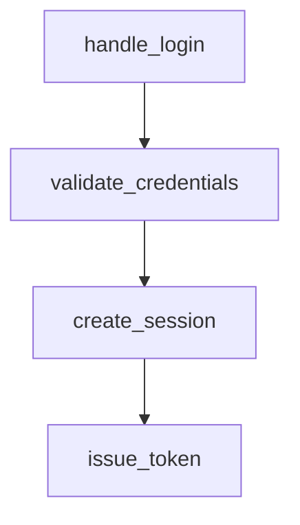

# Code Flow Skill

A portable **Code Flow** skill for AI coding assistants — Claude Code, Gemini CLI, and GitHub Copilot. Installs a `/code-flow` command (or equivalent instruction) that asks the assistant to trace a feature through your codebase and produce **both** a markdown document and an interactive HTML page describing exactly how it works.

## What the skill does

Given a feature or flow name (e.g. `user login`, `password reset`, `checkout`), the assistant will:

1. **Discover** the relevant files and functions using glob + grep searches.
2. **Trace the call chain** from entry point to final output, following every function that participates in the flow.
3. **Docstring any undocumented functions** encountered along the way, editing them in place.
4. **Generate `Code_Flows/<feature_name>.md`** containing:
   - A plain-language description of the flow's purpose and trigger conditions.
   - A MermaidJS flow/sequence diagram with every participating function as a named node.
   - A bullet list of all functions in the diagram.
   - A reference table with each function's description and exact `file:line` location.
5. **Generate `Code_Flows/<feature_name>.html`** — an interactive, self-contained view of the same flow (see below).
6. **Report** the paths to both generated files.

If you invoke the skill with no argument, the assistant will survey the project and suggest 3–5 candidate flows to pick from.

## Interactive HTML view

Alongside the markdown, the assistant produces a **single self-contained HTML file** you can explore in a browser — no server, no build step, no internet required. Just double-click it. It renders the flow as a browsable graph where you can:

- **Pan/zoom** the layered call graph and **Fit** it to view.
- **Click any function node** to open a side panel with its description, `file:line`, a code snippet, an "Open in VS Code" link, and clickable **Called by** / **Calls** lists to walk the flow.
- **Search/filter** functions by name, file, or description.
- **Highlight a path** — selecting a node lights up its full ancestor and descendant chain, answering "how did execution get here?" and "what happens next?".
- Toggle **light/dark** theme (persisted).

Node colors distinguish `entry` points, ordinary `step`s, `external` (third-party) boundaries, and `io` (DB/network/file) side effects. Edges distinguish plain `call`s, `async` calls (dashed), `conditional` branches (labeled), and `back`/cycle edges.

**How it works:** the installer drops a viewer scaffold at `.code-flow/viewer.template.html`. When you run the command, the assistant only has to emit a small JSON data block and inject it into that scaffold — so the interactive page is produced reliably, and the page self-validates (showing a clear error card, never a blank screen, if the data is malformed). If the scaffold is missing, the assistant falls back to a minimal Mermaid-based page.

## Usage

After installing (see below), invoke from inside your project:

**Claude Code**

```text
/code-flow user login
```

**Gemini CLI**

```text
/code-flow password reset
```

**GitHub Copilot**

The installer appends a "Code Flow" section to `.github/copilot-instructions.md`. In a Copilot chat, ask:

```text
Document the login flow using Code Flow.
```

In all three, the assistant writes its output to `Code_Flows/<feature_name>.md` **and** `Code_Flows/<feature_name>.html` at the project root.

### Example output

`Code_Flows/user_login.md` will look roughly like:

````markdown
# User Login — Flow

Brief description of what the flow does and when it runs.

## Diagram



## Functions

- `handle_login`
- `validate_credentials`
- `create_session`
- `issue_token`

## Reference

| Function | Description | File |
|----------|-------------|------|
| `handle_login` | HTTP handler for POST /login | `src/auth/login.py:42` |
| `validate_credentials` | Verifies email + password against the user store | `src/auth/credentials.py:18` |
| ...
````

A sibling `Code_Flows/user_login.html` is written at the same time — the interactive version of the same flow, ready to open in any browser.

## Install

### npm — local project (auto-installs templates)

```bash
npm i @htst/code-flow-skill
```

The `postinstall` script copies the Claude, Gemini, and Copilot templates into your project.

Skip the auto-install with either:

```bash
npm i @htst/code-flow-skill --code_flow_skip_install=true
# or
CODE_FLOW_SKIP_INSTALL=1 npm i @htst/code-flow-skill
```

### npm — global (manual install)

```bash
npm i -g @htst/code-flow-skill
code-flow-skill --tool all --target .
```

### uvx (Python)

```bash
uvx htst-code-flow-skill --tool all --target .
```

### Manual install (no npm, no uvx)

If neither `npm` nor `uvx` is available, you only need to copy two or three small text files into your project. There is no code to build and no runtime dependency.

**1. Get the templates.** Either clone the repo or download a zip from GitHub:

```bash
git clone https://github.com/plearaj/code-flow-skill.git
# or: download https://github.com/plearaj/code-flow-skill/archive/refs/heads/master.zip and unzip
```

You only need the `templates/` directory. The rest of the repo (packaging, installer script, `src/`) can be ignored.

**2. Copy the template(s) for the tool(s) you use** into your target project.

From the project root where you want the skill available:

```bash
# Claude Code
mkdir -p .claude/commands
cp /path/to/code-flow-skill/templates/claude/code-flow.md .claude/commands/code-flow.md

# Gemini CLI
mkdir -p .gemini/commands
cp /path/to/code-flow-skill/templates/gemini/code-flow.toml .gemini/commands/code-flow.toml

# GitHub Copilot — append to (or create) the instructions file
mkdir -p .github
cat /path/to/code-flow-skill/templates/copilot/code-flow.instructions.md >> .github/copilot-instructions.md

# Interactive HTML viewer scaffold (needed for all tools)
mkdir -p .code-flow
cp /path/to/code-flow-skill/templates/shared/viewer.template.html .code-flow/viewer.template.html
```

On Windows PowerShell, substitute `New-Item -ItemType Directory -Force` for `mkdir -p` and `Copy-Item` / `Add-Content` for `cp` / `cat >>`.

If you skip the `.code-flow/viewer.template.html` step, the command still works — the assistant just falls back to a minimal Mermaid-based HTML page instead of the full interactive viewer.

**3. Verify.** Restart your assistant (or start a new session). In Claude Code or Gemini CLI, typing `/` should list the new `/code-flow` command. For Copilot, the instructions will be picked up automatically on the next chat turn.

That's it — no install step runs any code on your machine. If you later want to update the skill, just re-copy the template files.

## CLI options

```text
code-flow-skill [--target PATH] [--tool claude|gemini|copilot|all]
```

Defaults: `--tool all`, `--target .`.

## Files written

| Tool | Path |
|------|------|
| Claude Code | `.claude/commands/code-flow.md` |
| Gemini CLI | `.gemini/commands/code-flow.toml` |
| GitHub Copilot | `.github/copilot-instructions.md` (appended) |
| _All tools_ | `.code-flow/viewer.template.html` (interactive HTML scaffold) |

The `.code-flow/viewer.template.html` scaffold is tool-agnostic and is installed regardless of which `--tool` you select, since every command template references it.

The Copilot installer is idempotent — it only appends if the `## Code Flow — Documentation Generator` section is not already present.

## Packages

- npm: [`@htst/code-flow-skill`](https://www.npmjs.com/package/@htst/code-flow-skill)
- PyPI / uvx: `htst-code-flow-skill`

## Publishing

### npm

```bash
npm publish --access public
```

### PyPI

```bash
uv build
uv publish
```

## License

Licensed under the [Apache License, Version 2.0](LICENSE).

Commercial use is welcome. If you use, redistribute, or fork this project, you **must**:

- Keep the `LICENSE` and `NOTICE` files intact.
- Preserve the copyright and attribution notices (credit to **Hightower Software Technologies**) in any derivative work.
- State any significant changes you made to the files.

See the `NOTICE` file for the required attribution text.
