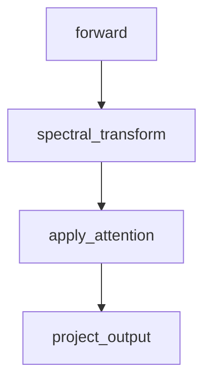

# Code Flow Skill

A portable **Code Flow** skill for AI coding assistants — Claude Code, Gemini CLI, and GitHub Copilot. Installs a `/code-flow` command (or equivalent instruction) that asks the assistant to trace a feature through your codebase and produce a markdown document describing exactly how it works.

## What the skill does

Given a feature or flow name (e.g. `spectral attention`, `training loop`, `login`), the assistant will:

1. **Discover** the relevant files and functions using glob + grep searches.
2. **Trace the call chain** from entry point to final output, following every function that participates in the flow.
3. **Docstring any undocumented functions** encountered along the way, editing them in place.
4. **Generate `Code_Flows/<feature_name>.md`** containing:
   - A plain-language description of the flow's purpose and trigger conditions.
   - A MermaidJS flow/sequence diagram with every participating function as a named node.
   - A bullet list of all functions in the diagram.
   - A reference table with each function's description and exact `file:line` location.
5. **Report** the path to the generated document.

If you invoke the skill with no argument, the assistant will survey the project and suggest 3–5 candidate flows to pick from.

## Usage

After installing (see below), invoke from inside your project:

**Claude Code**

```text
/code-flow spectral attention
```

**Gemini CLI**

```text
/code-flow training loop
```

**GitHub Copilot**

The installer appends a "Code Flow" section to `.github/copilot-instructions.md`. In a Copilot chat, ask:

```text
Document the login flow using Code Flow.
```

In all three, the assistant writes its output to `Code_Flows/<feature_name>.md` at the project root.

### Example output

`Code_Flows/spectral_attention.md` will look roughly like:

````markdown
# Spectral Attention — Flow

Brief description of what the flow does and when it runs.

## Diagram



## Functions

- `forward`
- `spectral_transform`
- `apply_attention`
- `project_output`

## Reference

| Function | Description | File |
|----------|-------------|------|
| `forward` | Entry point for the attention layer | `src/model/attention.py:42` |
| `spectral_transform` | Applies FFT to the input tensor | `src/model/spectral.py:18` |
| ...
````

## Install

### npm — local project (auto-installs templates)

```bash
npm i @htst/code-flow-skill
```

The `postinstall` script copies the Claude, Gemini, and Copilot templates into your project.

Skip the auto-install with either:

```bash
npm i @htst/code-flow-skill --code_flow_skip_install=true
# or
CODE_FLOW_SKIP_INSTALL=1 npm i @htst/code-flow-skill
```

### npm — global (manual install)

```bash
npm i -g @htst/code-flow-skill
code-flow-skill --tool all --target .
```

### uvx (Python)

```bash
uvx htst-code-flow-skill --tool all --target .
```

## CLI options

```text
code-flow-skill [--target PATH] [--tool claude|gemini|copilot|all]
```

Defaults: `--tool all`, `--target .`.

## Files written

| Tool | Path |
|------|------|
| Claude Code | `.claude/commands/code-flow.md` |
| Gemini CLI | `.gemini/commands/code-flow.toml` |
| GitHub Copilot | `.github/copilot-instructions.md` (appended) |

The Copilot installer is idempotent — it only appends if the `## Code Flow — Documentation Generator` section is not already present.

## Packages

- npm: [`@htst/code-flow-skill`](https://www.npmjs.com/package/@htst/code-flow-skill)
- PyPI / uvx: `htst-code-flow-skill`

## Publishing

### npm

```bash
npm publish --access public
```

### PyPI

```bash
uv build
uv publish
```

## License

Licensed under the [Apache License, Version 2.0](LICENSE).

Commercial use is welcome. If you use, redistribute, or fork this project, you **must**:

- Keep the `LICENSE` and `NOTICE` files intact.
- Preserve the copyright and attribution notices (credit to **Hightower Software Technologies**) in any derivative work.
- State any significant changes you made to the files.

See the `NOTICE` file for the required attribution text.
