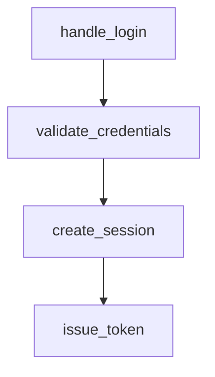

# Code Flow Skill

## Upgrading from 0.x to 1.0

The command was renamed and the Copilot integration changed. After upgrading:

- `/code-flow` is now `/code-flow.map`. Delete the stale command file:
  `.claude/commands/code-flow.md` or `.gemini/commands/code-flow.toml`.
- Copilot now installs an invocable prompt at
  `.github/prompts/code-flow.map.prompt.md`. The installer no longer edits
  `.github/copilot-instructions.md`.
  - **If you use Copilot in VS Code**, remove the old
    `## Code Flow — Documentation Generator` section from
    `.github/copilot-instructions.md` by hand — otherwise it lingers and
    contradicts the new prompt.
  - **If you use Copilot anywhere else** (github.com, JetBrains, Visual Studio,
    the CLI), **keep** that section. Prompt files are a documented VS Code
    feature; whether any other surface reads them has not been verified here, so
    assume the new prompt file does nothing for you. The instructions file is
    read across surfaces, and deleting it could leave you with no Code Flow skill
    at all. See the **GitHub Copilot** notes under *Usage* below.
- `/code-flow.map` now also writes `Code_Flows/<feature_name>.json` and
  `Code_Flows/index.json`. Flows mapped before 1.0 have no sidecar until re-mapped.

**The skills are new in 1.0 and additive.** You do not have to migrate to them.
They install alongside the command and prompt files, under different names
(`/code-flow-map`, not `/code-flow.map`), and both forms read the same
`Code_Flows/` artifacts — a flow mapped by one is readable by the other. See
[Skills and commands](#skills-and-commands) for which host gives which guarantee.

Everything 1.0 adds is listed in [CHANGELOG.md](CHANGELOG.md).

A portable **Code Flow** skill for AI coding assistants — Claude Code, GitHub Copilot, and Gemini CLI ([which Google retired for individual users on 2026-06-18](#--tool-all-and-gemini-cli) — its templates now install only where Gemini CLI is actually in use). Installs a `/code-flow.map` command that asks the assistant to trace a feature through your codebase and produce **both** a markdown document and an interactive HTML page describing exactly how it works.

## What the skill does

Given a feature or flow name (e.g. `user login`, `password reset`, `checkout`), the assistant will:

1. **Discover** the relevant files and functions using glob + grep searches.
2. **Trace the call chain** from entry point to final output, following every function that participates in the flow.
3. **Docstring any undocumented functions** encountered along the way, editing them in place.
4. **Generate `Code_Flows/<feature_name>.md`** containing:
   - A plain-language description of the flow's purpose and trigger conditions.
   - A MermaidJS flow/sequence diagram with every participating function as a named node.
   - A bullet list of all functions in the diagram.
   - A reference table with each function's description and exact `file:line` location.
5. **Generate `Code_Flows/<feature_name>.html`** — an interactive, self-contained view of the same flow (see below).
6. **Write `Code_Flows/<feature_name>.json`** — the same flow data as plain JSON — create or update the shared `Code_Flows/index.json` registry with an entry for this flow, and rebuild `Code_Flows/index.html` from that registry: the landing page listing every mapped flow, rewritten whenever the registry is. (Also written: `Code_Flows/inventory.json` — the function catalog — written by whole-codebase mode only; and `Code_Flows/quality-report.json` / `Code_Flows/quality-report.md` / `Code_Flows/quality-report.html` — written by `/code-flow.quality`, see [Quality reporting](#quality-reporting) below.)
7. **Report** the paths to the generated files.

If you invoke the skill with no argument, the assistant will survey the project and suggest 3–5 candidate flows to pick from.

## Interactive HTML view

Alongside the markdown, the assistant produces a **single self-contained HTML file** you can explore in a browser — no server, no build step, no internet required. Just double-click it. It renders the flow as a browsable graph where you can:

- **Pan/zoom** the layered call graph and **Fit** it to view.
- **Click any function node** to open a side panel with its description, `file:line`, a code snippet, an "Open in VS Code" link, and clickable **Called by** / **Calls** lists to walk the flow.
- **Search/filter** functions by name, file, or description.
- **Highlight a path** — selecting a node lights up its full ancestor and descendant chain, answering "how did execution get here?" and "what happens next?".
- Toggle **light/dark** theme (persisted).

Node colors distinguish `entry` points, ordinary `step`s, `external` (third-party) boundaries, and `io` (DB/network/file) side effects. Edges distinguish plain `call`s, `async` calls (dashed), `conditional` branches (labeled), and `back`/cycle edges.

**How it works:** the installer drops a viewer scaffold at `.code-flow/viewer.template.html`. When you run the command, the assistant only has to emit a small JSON data block and inject it into that scaffold — so the interactive page is produced reliably, and the page self-validates (showing a clear error card, never a blank screen, if the data is malformed). If the scaffold is missing, the assistant falls back to a minimal Mermaid-based page.

## Usage

After installing (see below), invoke from inside your project:

**Claude Code**

```text
/code-flow.map user login
```

**Gemini CLI** — retired for individual users on 2026-06-18, still supported on Gemini
Code Assist Standard/Enterprise licences and paid API keys. See [`--tool all` and Gemini
CLI](#--tool-all-and-gemini-cli) for when its templates install.

```text
/code-flow.map password reset
```

**GitHub Copilot**

The installer writes an invocable prompt file to `.github/prompts/code-flow.map.prompt.md`.

Prompt files — `.github/prompts/*.prompt.md` with `agent: agent` frontmatter, which is what this one is — are a **VS Code** Copilot Chat feature. In VS Code, open Copilot Chat and select the prompt from the Prompts picker, or try:

```text
/code-flow.map user login
```

Two things this project has **not** verified and therefore does not claim: that Copilot Chat exposes a *dotted* filename as a `/`-command (the `code-flow.map` name follows the [GitHub Spec Kit](https://github.com/github/spec-kit) prompt-file naming convention rather than any confirmed Copilot behavior), and whether Copilot surfaces other than VS Code read prompt files at all. If the slash form doesn't appear, use the Prompts picker.

**If you don't use Copilot in VS Code**, assume the prompt file does nothing for you. Instead, paste the body of `templates/copilot/code-flow.map.prompt.md` — everything below the `---` frontmatter — into `.github/copilot-instructions.md` under a `## Code Flow` heading; that file is read across Copilot surfaces. Upgrading from 0.x, you already have such a section: **keep it** instead of deleting it.

In all three, the assistant writes its output to `Code_Flows/<feature_name>.md`, `Code_Flows/<feature_name>.html`, and `Code_Flows/<feature_name>.json` at the project root, creates or updates the shared `Code_Flows/index.json` registry, and rebuilds `Code_Flows/index.html` from it.

### Whole-codebase mode

Instead of one feature, map the entire repository:

```text
/code-flow.map --whole-code-base
```

This runs two passes. The first walks the repository and catalogues every function
it finds into `Code_Flows/inventory.json`, recording a file census — size and
content hash — in `Code_Flows/index.json`. The second discovers entry points (HTTP
routes, CLI commands, `main()`, event handlers, scheduled jobs, exported API) and
traces each one into its own markdown, HTML and JSON, registering it in the index.

The second pass is the expensive one, and on a large repository it may not finish in
a single session. That is expected and not an error: re-run the command and it skips
the flows already registered in `index.json` and continues. `coverage` in that file
always records what was actually done — if `flowsTraced` is below
`entryPointsFound`, the map is partial and says so.

Whole-codebase mode never edits your source. Feature mode adds docstrings to
undocumented functions as it traces; at repository scale that would be a sweeping
unrequested rewrite, so this mode only reads.

Control how much evidence the catalog carries with `--detail`:

| Level | Each catalogued function carries | Use when |
|---|---|---|
| `thin` | signature, purpose, line count — no code snippet | Very large repositories |
| `standard` (default) | the above plus a snippet capped at ~20 lines | The balanced default |
| `verbose` | the above plus the full function body | Small repositories, or when you want artifacts that stand alone without the source tree |

```text
/code-flow.map --whole-code-base --detail verbose
```

Discovery is search and reading, not a compiler's view of your code. The artifacts
say "catalogued", never "all", and they mean it.

### Quality reporting

Once a whole-codebase map exists, analyze it:

```text
/code-flow.quality
/code-flow.quality --read-code
```

This reads `Code_Flows/index.json`, `inventory.json` and every `<flow>.json`, then
writes `Code_Flows/quality-report.json`, `Code_Flows/quality-report.md` and
`Code_Flows/quality-report.html`. The JSON is the data; the other two are
renderings of it, and none of the three may contradict another. The `.html` is a
single self-contained page — no server, no build step, no internet required —
that you open straight from disk, with the same coverage banner, the same
"catalogued, never all" wording, and filters by severity and principle. Four
detectors run:

| Detector | Principle | Reports |
|---|---|---|
| duplicate-intent | DRY | The same work implemented in several places |
| repeated-sequence | DRY | Call chains repeated across flows |
| complexity-hotspot | KISS | High fan-out, deep nesting, very long functions |
| unreached | YAGNI | Catalogued functions no mapped flow reaches |

Severity is rule-based — thresholds, not impressions — so findings do not all
drift toward "medium".

`--read-code` opens the files the candidate findings cite and confirms each
against current source, marking the survivors `verified` and dropping the rest;
without the flag every finding stays `unverified`. A candidate whose cited file
cannot be reopened at all — deleted, or unreadable — is neither: it stays
`unverified` and is then dropped as stale, which is why the dropped count is
usually, not always, zero under `--read-code`. It verifies candidates rather than
re-scanning the repository, so it costs far less than mapping. It requires the
source tree to be present and current, not just the artifacts.

The report **never edits your code** and never instructs deletion. Unreached
findings are candidates: tracing here is search and reading, so it cannot see
reflection, dependency injection, framework hooks or entry points declared in
configuration. Anything exported is capped at low severity.

Coverage leads every report. If the trace pass mapped 14 of 17 entry points, the
banner says so, and a clean section means clean *within what was mapped* — not a
clean bill of health.

Three things stop the command rather than degrading it: no `index.json` (run
`/code-flow.map` first), no `inventory.json` (run `/code-flow.map
--whole-code-base` first), and an `index.json` or `inventory.json` that does not
parse. A single unreadable `<flow>.json` does not stop it — that flow is skipped
and counted in the banner.

On a `--detail thin` map, duplicate-intent is skipped unless you pass
`--read-code`: a thin map carries no code snippets, so that detector has no
evidence to cite.

### Example map output

Back to `/code-flow.map`: `Code_Flows/user_login.md` will look roughly like:

````markdown
# User Login — Flow

Brief description of what the flow does and when it runs.

## Diagram


```mermaid
flowchart TD
    A[handle_login] --> B[validate_credentials]
    B --> C[create_session]
    C --> D[issue_token]
```

## Functions

- `handle_login`
- `validate_credentials`
- `create_session`
- `issue_token`

## Reference

| Function | Description | File |
|----------|-------------|------|
| `handle_login` | HTTP handler for POST /login | `src/auth/login.py:42` |
| `validate_credentials` | Verifies email + password against the user store | `src/auth/credentials.py:18` |
| ...
````

A sibling `Code_Flows/user_login.html` is written at the same time — the interactive version of the same flow, ready to open in any browser. A `Code_Flows/user_login.json` sidecar (the same flow data as plain JSON) is written alongside it, and `Code_Flows/index.json` is created or updated to register the flow. `Code_Flows/index.html` is rebuilt from that registry at the same time — start there to browse every flow you have mapped.

## Install

### npm — local project (auto-installs templates)

```bash
npm i @htst/code-flow-skill
```

The `postinstall` script copies the Claude, Gemini, and Copilot templates into your project.

Skip the auto-install with either:

```bash
npm i @htst/code-flow-skill --code_flow_skip_install=true
# or
CODE_FLOW_SKIP_INSTALL=1 npm i @htst/code-flow-skill
```

### npm — global (manual install)

```bash
npm i -g @htst/code-flow-skill
code-flow-skill --tool all --target .
```

### uvx (Python)

```bash
uvx htst-code-flow-skill --tool all --target .
```

### Manual install (no npm, no uvx)

If neither `npm` nor `uvx` is available, you only need to copy two or three small text files into your project. There is no code to build and no runtime dependency.

**1. Get the templates.** Pick whichever is easiest:

- **Download a release (recommended).** Grab `code-flow-templates-*.zip` from the [latest release](https://github.com/plearaj/code-flow-skill/releases/latest) — it contains only the `templates/` directory, nothing else. Unzip it anywhere.
- **Clone or download the repo:**

  ```bash
  git clone https://github.com/plearaj/code-flow-skill.git
  # or: download https://github.com/plearaj/code-flow-skill/archive/refs/heads/master.zip and unzip
  ```

You only need the `templates/` directory. The rest of the repo (packaging, installer script, `src/`) can be ignored.

**2. Copy the template(s) for the tool(s) you use** into your target project.

From the project root where you want the skill available:

```bash
# Claude Code
mkdir -p .claude/commands
cp /path/to/code-flow-skill/templates/claude/code-flow.map.md .claude/commands/code-flow.map.md
cp /path/to/code-flow-skill/templates/claude/code-flow.quality.md .claude/commands/code-flow.quality.md

# Gemini CLI — only if you actually use it; see the note on --tool all above
mkdir -p .gemini/commands
cp /path/to/code-flow-skill/templates/gemini/code-flow.map.toml .gemini/commands/code-flow.map.toml
cp /path/to/code-flow-skill/templates/gemini/code-flow.quality.toml .gemini/commands/code-flow.quality.toml

# GitHub Copilot
mkdir -p .github/prompts
cp /path/to/code-flow-skill/templates/copilot/code-flow.map.prompt.md .github/prompts/code-flow.map.prompt.md
cp /path/to/code-flow-skill/templates/copilot/code-flow.quality.prompt.md .github/prompts/code-flow.quality.prompt.md

# Flow index, interactive viewer and quality report scaffolds (needed for all tools)
mkdir -p .code-flow
cp /path/to/code-flow-skill/templates/shared/viewer.template.html .code-flow/viewer.template.html
cp /path/to/code-flow-skill/templates/shared/report.template.html .code-flow/report.template.html
cp /path/to/code-flow-skill/templates/shared/index.template.html .code-flow/index.template.html
```

On Windows PowerShell, substitute `New-Item -ItemType Directory -Force` for `mkdir -p` and `Copy-Item` for `cp`.

If you skip the `.code-flow/viewer.template.html` step, the command still works — the assistant just falls back to a minimal Mermaid-based HTML page instead of the full interactive viewer. If you skip the `.code-flow/report.template.html` step, `/code-flow.quality` still works too, but there is no fallback page for it: the command says so and still writes `quality-report.json` and `quality-report.md`. Skipping `.code-flow/index.template.html` costs you only `Code_Flows/index.html`, the page that links the flows together — every individual flow page still opens on its own.

**3. Verify.** Restart your assistant (or start a new session). In Claude Code or Gemini CLI, typing `/` should list **both** new commands — `/code-flow.map` and `/code-flow.quality`. For Copilot in VS Code, look for both prompts in the Prompts picker (or try `/code-flow.map` in chat); on other Copilot surfaces, see the **GitHub Copilot** notes under *Usage*.

That's it — no install step runs any code on your machine. If you later want to update the skill, just re-copy the template files.

## Skills and commands

Every host now gets the same two commands twice: as the command or prompt file it
has always had, and as an [Agent Skill](https://code.visualstudio.com/docs/agent-customization/agent-skills)
under `.agents/skills/` (and `.claude/skills/` for Claude Code). Nothing was
removed. If `/code-flow.map` works for you today, it still works.

**This is also how OpenAI Codex is supported.** Codex reads repository skills from
`.agents/skills/`, which every install writes, so it needs no `--tool` value of
its own. There is no Codex-specific command file and there does not need to be.

The two forms differ in three ways worth knowing before you pick one.

**The names differ, and they had to.** The skill form is `/code-flow-map` and
`/code-flow-quality`, with hyphens; the command form keeps `/code-flow.map` and
`/code-flow.quality`, with dots. Only Copilot documents a character rule for skill
names — no dots, and an invalid name silently fails to load — but Copilot reads
the same `.claude/skills/` directory Claude Code does, so there is no directory
where a laxer name would be safe. The dot is also spoken for: on Claude Code
`/code-flow.map` already belongs to the command file, which still ships.

**Who can start them differs by host.** Both skills set
`disable-model-invocation: true`, which asks the host to run them only when you
invoke them yourself. Not every host implements it:

| Host | Skill directory it reads | Can the assistant start the skill unasked? |
|---|---|---|
| Claude Code | `.claude/skills/` | No |
| GitHub Copilot | `.github/skills/`, `.claude/skills/`, `.agents/skills/` | No |
| Antigravity CLI | `.agents/skills/` | **Yes** — the field is not in its schema |
| Antigravity IDE | `.agents/skills/` | **Yes** — the field is not in its schema |
| OpenAI Codex | `.agents/skills/` | No — set in `agents/openai.yaml`, which ships beside each skill |
| Gemini CLI (legacy) | `.agents/skills/` | Yes, with a confirmation prompt |

**On Copilot, the same skill lands in two directories it both scans.** `--tool
all` writes `code-flow-map` to both `.claude/skills/` and `.agents/skills/`;
Copilot's docs list both as read locations but say nothing about precedence or
de-duplication when a name appears in both, so whether you see it once or
twice there is unverified here. `--tool copilot` writes only `.agents/skills/`,
which sidesteps the question if Copilot is the only host you use.

Codex reads that policy from its own metadata file rather than from `SKILL.md`,
so both files ship. On Codex, explicit invocation is `$code-flow-map` or the
`/skills` menu rather than a slash command.

On Antigravity there is no such setting to make. Both skills open by confirming
what they are about to do before writing anything, which is the only gate
available there — and the reason that paragraph is in the skill body rather than
in frontmatter.

On the hosts in the "Yes" rows, `code-flow-map` can begin because the conversation
drifted near what it does, rather than because you asked. That matters more for
this command than most: it writes files under `Code_Flows/` **and adds docstrings
to source files that lack them**. Its first instruction is therefore to name the
flow it is about to map and wait for you to confirm — a gate the assistant is free
to skip, which is why this table is here rather than buried. The edits are
additive, never rewrites or deletions. If that trade is not one you want, use the
command form on those hosts, or don't install the skill.

**The flags work the same in both.** `--whole-code-base`, `--detail
thin|standard|verbose` and `--read-code` are read out of what you type either way.
The skill format has no `$ARGUMENTS` substitution, so the skills advertise their
flags through `argument-hint` instead — your host shows them during autocomplete.

## CLI options

```text
code-flow-skill [--target PATH] [--tool claude|gemini|copilot|all]
```

Defaults: `--tool all`, `--target .`.

### `--tool all` and Gemini CLI

`--tool all` installs the Claude and Copilot templates unconditionally, and the Gemini
CLI templates **only if your project already has a `.gemini/` directory.**

Gemini CLI stopped serving free, Google AI Pro and Ultra, and individual Gemini Code
Assist users on **2026-06-18**; its successor, Antigravity, does not read
`.gemini/commands/` at all. The TOML commands still ship, because Gemini Code Assist
**Standard and Enterprise** licences and paid API keys keep Gemini CLI — but writing
them into every project would leave a dead directory in most of them.

The check looks at your project, not your home directory. Both Antigravity surfaces
keep workspace files under `.agents/` and their global files under
`~/.gemini/antigravity/` and `~/.gemini/antigravity-cli/`, so a *project-level*
`.gemini/` is a Gemini CLI signal in a way that `~/.gemini/` is not.

When the templates are skipped the installer says so and prints the flag that installs
them anyway. `--tool gemini` is an explicit request and always installs, regardless of
what is or is not in your project:

```bash
code-flow-skill --tool gemini
```

## Files written

| Tool | Command | Path |
|------|---------|------|
| Claude Code | `/code-flow.map` | `.claude/commands/code-flow.map.md` |
| Claude Code | `/code-flow.quality` | `.claude/commands/code-flow.quality.md` |
| Claude Code | `/code-flow-map` | `.claude/skills/code-flow-map/SKILL.md` |
| Claude Code | `/code-flow-quality` | `.claude/skills/code-flow-quality/SKILL.md` |
| Gemini CLI | `/code-flow.map` | `.gemini/commands/code-flow.map.toml` |
| Gemini CLI | `/code-flow.quality` | `.gemini/commands/code-flow.quality.toml` |
| GitHub Copilot | `/code-flow.map` | `.github/prompts/code-flow.map.prompt.md` |
| GitHub Copilot | `/code-flow.quality` | `.github/prompts/code-flow.quality.prompt.md` |
| Copilot, Antigravity, Codex, Gemini CLI | `/code-flow-map` | `.agents/skills/code-flow-map/SKILL.md` |
| Copilot, Antigravity, Codex, Gemini CLI | `/code-flow-quality` | `.agents/skills/code-flow-quality/SKILL.md` |
| Codex | — | `.agents/skills/code-flow-map/agents/openai.yaml` (invocation policy) |
| Codex | — | `.agents/skills/code-flow-quality/agents/openai.yaml` (invocation policy) |
| _All tools_ | — | `.code-flow/viewer.template.html` (interactive HTML scaffold) |
| _All tools_ | — | `.code-flow/report.template.html` (quality report viewer scaffold) |
| _All tools_ | — | `.code-flow/index.template.html` (flow index scaffold) |

The `.code-flow/viewer.template.html`, `.code-flow/report.template.html` and `.code-flow/index.template.html` scaffolds are tool-agnostic and are installed regardless of which `--tool` you select, since every command template references one of them.

`.agents/skills/` is installed regardless of `--tool` for the same reason: it is the shared location every supported host except Claude Code reads. `.claude/skills/` is the one directory only Claude Code reads, so it installs with the `claude` selection — `--tool gemini` still leaves no `.claude/` directory in your project.

**OpenAI Codex has no `--tool` value and does not need one.** It discovers repository skills from `.agents/skills/`, which every install writes.

## Packages

- npm: [`@htst/code-flow-skill`](https://www.npmjs.com/package/@htst/code-flow-skill)
- PyPI / uvx: `htst-code-flow-skill`

## Publishing

### Before publishing

No test in this repository executes any scaffold's rendering — `templates/shared/viewer.template.html`,
`templates/shared/report.template.html` and `templates/shared/index.template.html` are checked for what
their prompt-filled content says, never for how a browser draws it. That gap is accepted (see
`docs/superpowers/specs/2026-08-07-phase3b-report-viewer-design.md`, Decision 1), on the
condition that a human closes it by hand before every release:

1. Run `/code-flow.map` and `/code-flow.quality` against any project and open the resulting
   `Code_Flows/index.html`, `Code_Flows/<flow>.html` and `Code_Flows/quality-report.html` in a
   browser. Confirm each renders its registry, diagram or findings instead of a blank page or a
   raw JSON dump, and that the index's flow cards and the pages' `Flows` links actually navigate.
2. Corrupt one of the two files' embedded JSON (edit a character inside the
   `<script type="application/json">` block so it no longer parses) and reload it. Confirm
   the page shows the red error card instead of a blank page or a silent failure.

Do this for both files, every release — a change to either scaffold's rendering re-opens the
gap and the test suite will not tell you.

Add the release's entry to [CHANGELOG.md](CHANGELOG.md) before bumping the version.
`tests/test_packaging.py` fails if the changelog's leading `## [version]` heading does not
match the version both packages declare, so a forgotten entry is caught rather than shipped.

`npm publish` enforces this. `scripts/prepublish-check.js` runs as `prepublishOnly`, prints
the checklist and **fails the publish** until you acknowledge it. To read the checklist
without publishing anything:

```bash
npm run release-check
```

### npm

```bash
CODE_FLOW_RELEASE_CHECKED=1 npm publish --access public
```

### PyPI

`uv publish` has no equivalent hook, so the same checklist is on you here — run
`npm run release-check` first and work through it by hand.

```bash
uv build
uv publish
```

## License

Licensed under the [Apache License, Version 2.0](LICENSE).

Commercial use is welcome. If you use, redistribute, or fork this project, you **must**:

- Keep the `LICENSE` and `NOTICE` files intact.
- Preserve the copyright and attribution notices (credit to **Hightower Software Technologies**) in any derivative work.
- State any significant changes you made to the files.

See the `NOTICE` file for the required attribution text.
