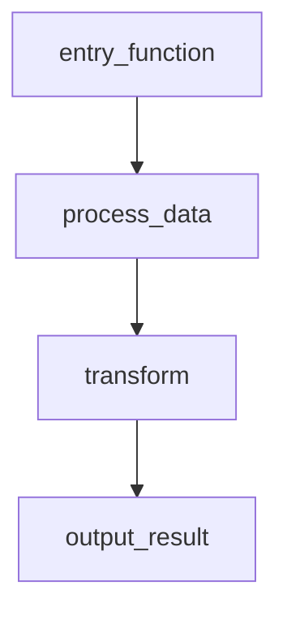

## User Input

```text
$ARGUMENTS
```

You **MUST** consider the user input before proceeding (if not empty).

## Code Flow — Documentation Generator

Analyze the codebase and generate flow documentation for the requested functionality.

### Instructions

Follow these steps exactly:

#### 1. Identify the Target Flow

The user's input (`$ARGUMENTS`) describes the functionality to document. If the input is empty, analyze the project structure and suggest 3-5 key flows, then ask the user to pick one.

Use the functionality name to derive the output filename. Convert to snake_case (e.g., "user login" → `user_login.md`, "password reset" → `password_reset.md`).

#### 2. Discover Relevant Files and Functions

Find all code related to the target flow:
- Use `Glob` to find relevant files (e.g., `**/*auth*.py`, `**/*login*.py`)
- Use `Grep` to find functions, classes, keywords, and entry points related to the flow
- Read the contents of discovered files to trace the call chain

Trace the full execution path — follow function calls from entry point through to the final output. Include every function that participates in the flow.

#### 3. Document Undocumented Functions

For each function in the flow that lacks a docstring:
1. Analyze the function's code to understand its purpose, parameters, and return value
2. Generate a clear, concise docstring
3. Add the docstring to the function using the Edit tool

#### 4. Generate Flow Documentation

Create `Code_Flows/<functionality_name>.md` with these sections:

**4a. Flow Description**
A brief description of the flow's purpose and when/how it is triggered.

**4b. Flow Diagram**
A MermaidJS flowchart or sequence diagram. Every function in the flow MUST appear as a named node.

Example:
````markdown

````

**4c. Function List**
A bullet list of ALL function names that appear in the flow diagram.

**4d. Function Reference Table**
A table with every function's description and exact file location:

```markdown
| Function | Description | File |
|----------|-------------|------|
| `entry_function` | Entry point that initializes the pipeline | `src/module/main.py:23` |
| `process_data` | Validates and preprocesses input data | `src/module/data.py:45` |
```

The **File** column MUST include the file path and line number in `file:line` format.

#### 5. Finalize

- Create the `Code_Flows/` directory if it doesn't exist
- Write the markdown file to `Code_Flows/<functionality_name>.md`
- Report the output file path to the user
