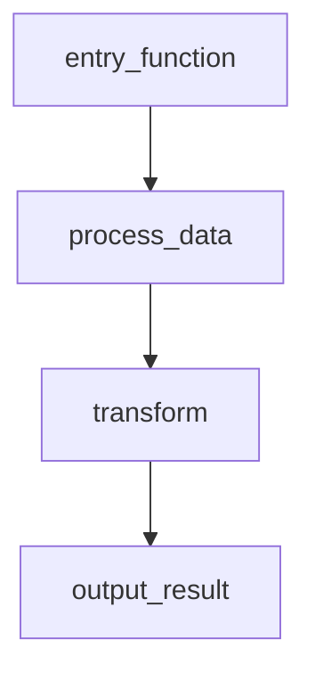

## User Input

```text
$ARGUMENTS
```

You **MUST** consider the user input before proceeding (if not empty).

## Code Flow — Documentation Generator

Analyze the codebase and generate flow documentation for the requested functionality.

### Instructions

Follow these steps exactly:

#### 1. Identify the Target Flow

The user's input (`$ARGUMENTS`) says what to document. Read it first for two option
flags. They are options, not part of the feature name — strip them out before you
derive any filename from what is left.

- `--whole-code-base` — map the whole repository instead of one feature. If it is
  present, skip the rest of this section and everything through step 7, and follow
  **Whole-Codebase Mode** at the end of this document instead.
- `--detail thin|standard|verbose` — how much evidence each catalogued function
  carries. Default `standard`. It only changes anything in whole-codebase mode; if
  it appears without `--whole-code-base`, accept it silently rather than erroring.
  If it appears with a value that is not one of those three, tell the user what you
  read, use `standard`, and carry on.
- `--output files|bundle|both` chooses which HTML gets written, default `files`.
  `files` writes `index.html`, one page per flow, and the quality report page,
  exactly as before. `both` adds `Code_Flows/code-flow.html`, a single
  self-contained page carrying every flow. `bundle` writes that page and no other
  HTML. If its value is not one of those three, say what you read, use `files`,
  and carry on. **`--output` never suppresses the JSON artifacts** —
  `index.json`, `<functionality_name>.json` and `inventory.json` are written in
  every mode, because `/code-flow.quality` reads them and a run that skipped
  them would break it silently.

Everything from here through step 7 is **feature mode**, the default.

The remaining input describes the functionality to document. If it is empty,
analyze the project structure and suggest 3-5 key flows, then ask the user to pick
one.

Use the functionality name to derive the output filename. Convert to snake_case
(e.g., "user login" → `user_login.md`, "password reset" → `password_reset.md`).

#### 2. Discover Relevant Files and Functions

Find all code related to the target flow:
- Use `Glob` to find relevant files (e.g., `**/*auth*.py`, `**/*login*.py`)
- Use `Grep` to find functions, classes, keywords, and entry points related to the flow
- Read the contents of discovered files to trace the call chain

Trace the full execution path — follow function calls from entry point through to the final output. Include every function that participates in the flow.

#### 3. Document Undocumented Functions

For each function in the flow that lacks a docstring:
1. Analyze the function's code to understand its purpose, parameters, and return value
2. Generate a clear, concise docstring
3. Add the docstring to the function using the Edit tool

#### 4. Generate the Markdown Documentation

Create `Code_Flows/<functionality_name>.md` with these sections:

**4a. Flow Description**
A brief description of the flow's purpose and when/how it is triggered.

**4b. Flow Diagram**
A MermaidJS flowchart or sequence diagram. Every function in the flow MUST appear as a named node.

Example:
````markdown

````

**4c. Function List**
A bullet list of ALL function names that appear in the flow diagram.

**4d. Function Reference Table**
A table with every function's description and exact file location:

```markdown
| Function | Description | File |
|----------|-------------|------|
| `entry_function` | Entry point that initializes the pipeline | `src/module/main.py:23` |
| `process_data` | Validates and preprocesses input data | `src/module/data.py:45` |
```

The **File** column MUST include the file path and line number in `file:line` format.

#### 5. Generate the Interactive HTML View

By default, **also** produce a self-contained interactive HTML page next to the markdown. It renders the same flow as a browsable graph: pan/zoom, click a node for its description + `file:line` + code snippet, search functions, and highlight a path. The page is a single file with everything inlined — it works by double-clicking, with no internet or build step.

**5a. Build the flow-data JSON.** Assemble ONE JSON object describing the same flow you diagrammed in step 4:

```json
{
  "meta": {
    "feature": "User Login",
    "slug": "user_login",
    "description": "<the same plain-language description from 4a>",
    "generated": "<today's date, YYYY-MM-DD>",
    "root": "<absolute path to the project root, forward slashes>",
    "tool": "code-flow"
  },
  "nodes": [
    { "id": "src_web_views_login_view", "label": "login_view()", "file": "src/web/views.py", "line": 12, "kind": "entry", "description": "HTTP handler for POST /login.", "snippet": "def login_view(request):\n    ..." }
  ],
  "edges": [
    { "from": "src_web_views_login_view", "to": "src_auth_service_authenticate_user", "kind": "call", "label": "", "back": false }
  ]
}
```

Rules — follow these exactly, or the page will refuse to render:

- One node per function in the diagram. **Every `edge.from` and `edge.to` MUST match a node `id`.**
- `id` is derived from the node's own `file` and function name, so that the same function always gets the same `id` in every flow and downstream tools can join flow nodes against a function catalog. Derive it exactly like this: **(1)** take the repo-relative `file` path and drop the extension from its **last segment only** — the final `.` in the filename and everything after it, so `src/v2.1/handler.py` → `src/v2.1/handler`, and a filename with no dot loses nothing; **(2)** append `_` followed by the function's **unqualified** name — `authenticate`, never `User.authenticate` — which is the same name a function catalog records for it; **(3)** lowercase the whole string, replace every remaining character outside `[a-z0-9_]` (path separators, dots, dashes, spaces, anything else) with `_`, collapse each run of `_` into a single `_`, and trim any leading or trailing `_`. Example: `src/web/views.py` + `login_view` → `src_web_views_login_view`. If **the file itself** defines more than one function with that name — same-named methods on two classes, or an overload — append `_l` and the line number of the function's own definition keyword — the
`def`, `function`, `func` or `fn` line itself, never a decorator, annotation or
comment line above it: `src_jobs_worker_run_l31` and `src_jobs_worker_run_l88`. Decide that from the file's own contents, never from which nodes happen to be in this flow: an `id` must not change depending on what else you mapped.
- `kind` on a **node** ∈ `entry` | `step` | `external` | `io` (default `step`). `entry` = where the flow starts; `external` = a third-party/library boundary; `io` = a DB/network/file side effect. This drives node color.
- **Exactly one** node MUST have `kind: entry`. If the flow has several plausible roots — two HTTP handlers, say — pick the one the user asked about, make that the `entry`, and mark the others `step`.
- `kind` on an **edge** ∈ `call` | `async` | `conditional` (default `call`). Set `"back": true` on any edge that closes a loop or recursion (points back to an ancestor) so it is drawn as a routed dashed curve.
- All file paths use **forward slashes**, repo-relative. `meta.root` is the absolute project root with forward slashes (used only to build editor links).
- `snippet` is optional — a short excerpt (≤ ~40 lines). **Inside every `snippet` string, replace each `</` with `<\/`** (a literal `</script>` would terminate the data block). No trailing commas anywhere.

**5b. Fill the template.** Read `.code-flow/viewer.template.html`. Write `Code_Flows/<functionality_name>.html` as an **exact copy** of that template with three tokens replaced and nothing else changed. `__FLOW_DATA__` becomes the JSON object from 5a. `__FLOW_INDEX__` becomes the `flows` array as it will stand after step 6b — read `Code_Flows/index.json` now, apply this flow's entry to a copy of its `flows` array, and use that; it drives the page's flow switcher. If `index.json` is missing or does not parse, leave `__FLOW_INDEX__` exactly as you found it: the page then hides the switcher and keeps its link to the index, which is the right behavior for a registry that is not there. `__THEME_CSS__` becomes the contents of `.code-flow/theme.css`, or an empty string if that file does not exist or cannot be read. (The page self-validates on load: if the JSON is malformed or an edge points at a missing node, it shows a specific error card instead of a blank page — read it and fix the JSON.)

**5c. Fallback if the template is missing.** If `.code-flow/viewer.template.html` does not exist (the skill was only partially installed), write this minimal page to `Code_Flows/<functionality_name>.html` instead, then tell the user to reinstall `code-flow` for the full interactive viewer:

````html
<!DOCTYPE html>
<html lang="en">
<head>
<meta charset="utf-8">
<title><FEATURE> — Flow</title>
<script src="https://cdn.jsdelivr.net/npm/mermaid@11/dist/mermaid.min.js"></script>
<style>body{font-family:system-ui,sans-serif;margin:2rem;max-width:60rem}
.banner{background:#fff3cd;border:1px solid #e0c060;padding:.5rem .75rem;border-radius:6px}</style>
</head>
<body>
<p class="banner">Reduced interactive mode — reinstall <code>code-flow</code> for the full interactive viewer.</p>
<h1><FEATURE> — Flow</h1>
<pre class="mermaid">
<!-- paste the SAME mermaid source from step 4b here -->
</pre>
<script>mermaid.initialize({ startOnLoad: true });</script>
</body>
</html>
````

#### 6. Write the Machine-Readable Artifacts

These files are the contract consumed by `code-flow.quality`. They are not
optional, and they are not derived by parsing the generated HTML.

**6a. The flow sidecar.** Write `Code_Flows/<functionality_name>.json` containing
exactly the JSON object you built in step 5a — the same `meta`, `nodes`, and
`edges`. This is the same data embedded in the HTML page, written as a plain file
so downstream tools never have to parse markup.

**6b. The index.** Create or update `Code_Flows/index.json`. If it does not exist,
create it with this shape. If it does exist, read it, add or replace the entry for
this flow in `flows` (matching on `slug`), and write it back — preserving every
other entry and any existing `coverage` values you did not compute. If it exists
but does not parse as JSON, **stop**: do not overwrite it and do not regenerate
it. Report the file path and what is wrong with it to the user, and let them
repair or delete it — rewriting the file would silently discard the registry of
every flow mapped before this one.

```json
{
  "meta": { "root": "<absolute project root, forward slashes>",
            "generated": "<today, YYYY-MM-DD>", "mode": "feature", "schema": 1 },
  "coverage": { "flowsTraced": 1 },
  "flows": [
    { "slug": "user_login", "title": "User Login", "file": "user_login.json",
      "entry": "src_web_views_login_view", "nodes": 9 }
  ]
}
```

- `slug` is the snake_case functionality name. `title` is `meta.feature` from
  the sidecar's JSON object (step 5a). `file` is the sidecar's filename,
  relative to `Code_Flows/` — a bare filename, not a path.
- `entry` is the `id` of the one node whose `kind` is `entry` — step 5a requires
  exactly one.
- `nodes` is the count of entries in the flow's `nodes` array.
- `coverage.flowsTraced` is the length of `flows` after your update.
- Set `meta.mode` to `feature` — **unless the file already has
  `"mode": "whole-code-base"`, in which case leave `meta.mode` and `meta.detail`
  exactly as you found them.** Whole-codebase mode reuses this step, and rewriting
  the marker there would leave a whole-repository map claiming to be a
  single-feature one.

**6c. The index page.** `index.json` is the data; `Code_Flows/index.html` is how a
person reads it. Read `.code-flow/index.template.html` and write
`Code_Flows/index.html` as an **exact copy** of that template with two tokens
replaced. `__INDEX_DATA__` becomes the registry object you just wrote in 6b.
`__THEME_CSS__` becomes the contents of `.code-flow/theme.css`, or an empty
string if that file does not exist or cannot be read. Change nothing else in the
template. Inside every string value, replace each `</` with `<\/`, exactly as in
step 5a.

Do this **every time you write `index.json`** — here, and in whole-codebase mode's
pass 1. The two files are one artifact in two forms, and an `index.html` carried
over from an earlier run advertises a registry that no longer exists.

A flow page's switcher lists the registry as it stood when that page was written,
so a page written earlier does not know about flows mapped later. `index.html` is
rebuilt from the registry every run and is always current, which is why every page
links back to it.

If `.code-flow/index.template.html` does not exist (the skill was only partially
installed), skip `index.html`, leave any existing one untouched, and tell the user
to reinstall `code-flow` for the flow index. There is no fallback page here: the
registry is already readable as `index.json`, and a hand-built substitute would be
one more file to keep in step with it.

**6d. The bundle.** If `--output` is `bundle` or `both`, read
`.code-flow/bundle.template.html` and write `Code_Flows/code-flow.html` as an
**exact copy** with two tokens replaced. `__BUNDLE_DATA__` becomes `{"index": <the
object you just wrote to index.json>, "flows": [<the full JSON object for every
flow in the registry, read back from its sidecar>], "report": <the object in
Code_Flows/quality-report.json if that file exists and parses, otherwise null>}`.
`__THEME_CSS__` becomes the contents of `.code-flow/theme.css`, or an empty string
if that file does not exist or cannot be read — an absent theme is the normal
case and is never an error. Inside every string value, replace each `</` with
`<\/`, exactly as in step 5a.

Rebuild it from the sidecars every time, never by editing an existing bundle: the
JSON is the data and this page is one rendering of it, so a bundle is always
current by construction. If a sidecar is missing or does not parse, leave that
flow out, and say which and why in your step 7 report.

If `.code-flow/bundle.template.html` does not exist, say so and skip the bundle.
There is no fallback page here.

#### 7. Finalize

- Create the `Code_Flows/` directory if it doesn't exist
- Write `Code_Flows/<functionality_name>.md`, `.html`, and `.json`, plus `index.json`
  and `index.html`
- If `--output` was `bundle` or `both` and the bundle was written, also report
  `Code_Flows/code-flow.html`
- Report the markdown and HTML paths to the user, name `Code_Flows/index.html` as
  the page that lists every mapped flow, and mention that the JSON artifacts were
  updated

## Whole-Codebase Mode

Reached only when the user passed `--whole-code-base`. Two passes: catalogue what
exists, then trace how it runs. The passes are separate because they answer
different questions and because the second one is far more expensive than the first.

**This mode never edits source files.** Feature mode adds docstrings as it goes
(step 3); at repository scale that would be a sweeping unrequested rewrite, so here
you only read. Report undocumented functions in the inventory's `purpose` field
instead — inferred from the body when there is no docstring.

### Pass 1 — Breadth: catalogue what exists

This pass traces nothing. It records what is there.

**1.1 Choose the files to scan.** Walk the repository from the project root,
honoring `.gitignore`. Skip in addition: `node_modules`, `.venv`, `venv`, `dist`,
`build`, `target`, `vendor`, `third_party`; lockfiles (`package-lock.json`,
`yarn.lock`, `uv.lock`, `poetry.lock`, `Cargo.lock`, `go.sum`); minified or
generated assets (`*.min.js`, `*.min.css`, `*.map`); and anything binary. Count every skip and attribute it to exactly one reason: `vendored` for code you
did not write (`node_modules`, `vendor`, `third_party`); `generated` for build
output and machine-written files (`dist`, `build`, `target`, lockfiles, minified
assets); `binary` for anything that is not text; `unparsed` for a file you opened
but could not read structure from. A `.gitignore` match is not itself a reason —
give the file the reason that fits what it is. If two fit, use the one listed
first here, so two runs over the same repository produce the same counts.

**1.2 Catalogue the functions.** Write `Code_Flows/inventory.json` with one entry
per function or method you find:

```json
{
  "schema": 1,
  "functions": [
    {
      "id": "src_auth_validators_validate_email",
      "name": "validate_email",
      "file": "src/auth/validators.py",
      "line": 12,
      "loc": 14,
      "signature": "validate_email(value: str) -> bool",
      "purpose": "Return True if value looks like an email address.",
      "role": "source",
      "exported": false,
      "snippet": "def validate_email(value):\n    ..."
    }
  ]
}
```

- `id` — derived exactly as in step 5a, from the same `file` and unqualified
  `name`. This is the whole point of the pass: a flow node and the inventory entry
  for the same function carry the same `id`, and that join is what lets a later
  command compute which catalogued functions no flow ever reaches.
- `name` — the function's **unqualified** name, the same form the `id` rule uses:
  `send`, never `EmailGateway.send`.
- `line` — the line of the function's own definition keyword, never a decorator or
  comment above it. `loc` — its length in lines, definition line through last line
  inclusive.
- `signature` — the declaration as written, on one line, without the body.
- `purpose` — one sentence. Use the docstring if there is one; otherwise infer it
  from the body. Do not edit the source file to add one.
- `role` — `"test"` if the file is a test (a `test_*`/`*_test`/`*.test.*`/`*.spec.*`
  name, or a `tests/`, `test/`, `spec/`, `__tests__/` directory), `"source"`
  otherwise. **Catalogue tests, never skip them.** Excluding them would make every
  helper that only tests use look unreachable.
- `exported` — whether the function is public API. A per-language heuristic, not a
  proof: the `export` keyword in JS/TS, a name without a leading underscore (and
  `__all__` membership where a module defines it) in Python, an initial capital in
  Go. **When the language or the convention is unclear, use `true`** — wrongly
  calling something private produces a false dead-code claim later, which is the
  more expensive mistake.
- `snippet` — governed by `--detail`:

| `--detail` | `snippet` |
|---|---|
| `thin` | omit it entirely |
| `standard` (default) | include, capped at ~20 lines; omit for functions of 3 lines or fewer, since a trivial accessor tells a duplicate-detector nothing |
| `verbose` | include the full body, uncapped |

  Inside every `snippet`, replace each `</` with `<\/`, exactly as in step 5a.

**1.3 Record the file census.** In `Code_Flows/index.json`, set `meta.mode` to
`"whole-code-base"` and `meta.detail` to the level you used, then record one entry
per scanned file and the breadth half of `coverage`:

```json
{
  "meta": { "root": "<absolute project root, forward slashes>",
            "generated": "<today, YYYY-MM-DD>", "mode": "whole-code-base",
            "detail": "standard", "schema": 1 },
  "coverage": { "filesScanned": 214, "filesSkipped": 12,
                "skipReason": { "vendored": 9, "unparsed": 3 },
                "functionsCatalogued": 1180 },
  "files": [
    { "path": "src/auth/validators.py", "size": 4210, "hash": "sha256:9f2a1c" }
  ],
  "flows": []
}
```

The `flows` array and the rest of `coverage` belong to pass 2 — preserve whatever
is already there, and preserve every `coverage` value you did not compute. The
same rule as feature mode applies: if `index.json` exists but does not parse,
**stop**, report it, and do not overwrite it.

Step 6c applies here too: having written `index.json`, rewrite `Code_Flows/index.html`
from it. After pass 1 that page shows the census and says plainly that no flows have
been traced yet — which is what a half-finished map should look like.

`filesScanned` and `functionsCatalogued` describe the whole catalog, including files
carried forward unchanged from an earlier run — not only what this session re-read.
They are facts about the map, not about the session.

`hash` lets a later command warn that the map is stale without re-reading source.
Compute it with whatever the environment provides — `sha256sum <file>`,
`Get-FileHash -Algorithm SHA256 <file>`, or `certutil -hashfile <file> SHA256` —
and record `sha256:` followed by the first 6 hex characters. **If you cannot run
commands here, set `"hash": null` for every file and say so in your final report.
Never invent a hash value**; `size` alone still catches most edits.

**1.4 Resuming.** If `files` already lists a path whose `size` and `hash` are
unchanged, keep that file's existing `functions` entries and move on rather than
re-reading it. A repository too large to catalogue in one session is finished by
running the command again.

Before trusting `files[]`, read `Code_Flows/inventory.json`. If it is missing, or
exists but does not parse, ignore the census entirely and catalogue every file from
scratch — a census without a readable inventory would carry forward entries that are
no longer there, and the counts would describe a catalog that does not exist.

### Pass 2 — Trace: map the flows

**2.1 Find the entry points.** An entry point is where execution enters the system
from outside it: HTTP routes and their handlers, CLI commands and subcommands,
`main()`, event and queue handlers, scheduled jobs, and the exported public API.
Use the inventory you just built — `exported` is a strong hint — plus the framework
conventions the repository actually uses (route decorators, a router table, an
`argv` parser, a job registry).

Record how many you found as `coverage.entryPointsFound` **before you trace any of
them**. Recording it first is what makes an unfinished run visible: `flowsTraced`
below `entryPointsFound` means the map is partial.

**2.2 Trace each one.** For every entry point not already mapped, run feature mode's
steps 2, 4, 5 and 6 exactly as written, treating that entry point as the requested
flow — but **skip step 3**: this mode does not edit source. Each flow produces its
own `Code_Flows/<slug>.md`, `.html` and `.json`, and its own entry in `index.json`'s
`flows` array. Derive the slug from the entry point's own name.

Step 6 must leave `meta.mode` at `whole-code-base` and `meta.detail` as pass 1 set
them — it is the only step here that writes `meta`, and this mode depends on those
two values surviving every flow you trace.

**2.3 Skip what is already mapped.** Before tracing, check `index.json`'s `flows`
for that slug. If it is already there, skip it and move on — do not re-trace and do
not overwrite its files. This is what lets a repository be mapped across several
sessions: run the command again and it picks up where it stopped.

**2.4 Stop honestly.** A partial pass 2 is not an error. If you run out of room,
stop cleanly after finishing the flow you are on, leave `index.json` consistent, and
tell the user how many of the entry points you traced and that re-running continues
from there. Set `coverage.flowsTraced` to the length of `flows` — what you actually
did, never what you intended.

**2.5 Report.** Tell the user: the counts from `coverage`, where the artifacts are,
and — if `flowsTraced` is below `entryPointsFound` — that the map is partial and how
to finish it. Say **catalogued**, never "all": this discovery is search and reading,
not a compiler's view of the code, so it is best-effort by construction.
